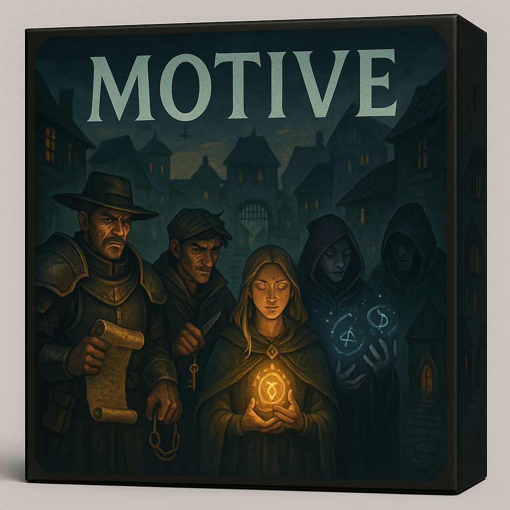

# Motive



Motive is a novel platform designed for the exploration and benchmarking of Large Language Models (LLMs) through interactive, turn-based games. It provides a unique environment where AI (or human) players can engage in complex scenarios, fostering the generation of valuable training data and facilitating research into advanced AI capabilities like long-context reasoning, planning, and social engineering.

## Purpose of Motive

*   **Turn-Based Game with Chat Interface:** Motive enables the creation and execution of turn-based games with a chat-based interface. These games can be played by AI agents or human participants, with the potential for environments, characters, and objects to be dynamically balanced via AI simulation.

*   **LLM Benchmarking:** The platform is built to benchmark various LLMs by having them compete against each other. This includes evaluating generic pre-trained LLMs, Motive-fine-tuned models, and new architectural innovations.

*   **Training Data Generation:** Motive serves as a rich source of training data for future LLM development. It focuses on generating data with verifiable objectives, open-ended player-to-player communication, and tree rollouts, which are crucial for exploring long-context understanding, complex reasoning, intricate planning, and sophisticated social engineering tactics.

## Getting Started (For Developers)

To get your local development environment set up and running with Motive, follow these steps:

### Prerequisites

*   **Python 3.10+**: Ensure you have a compatible Python version installed and added to your system PATH.
*   **Git**: For cloning the repository.
*   **API Keys**: Access to API keys for your desired LLM providers (e.g., OpenAI, Google Generative AI, Anthropic). Refer to `env.example.txt` and `configs/game.yaml`.

### 1. Clone the Repository

```bash
git clone https://github.com/YOUR_USERNAME/Motive.git  # Replace with your actual repo URL
cd Motive
```

### 2. Quick Setup (Automated)

The easiest way to set up the project is using the provided setup scripts:

#### Windows (PowerShell)

**First, install Python if you haven't already:**
1. Download Python 3.10+ from https://www.python.org/downloads/
2. **Important**: During installation, check "Add Python to PATH"
3. Verify installation: `python --version` and `pip --version`

**Then run the setup script:**
```powershell
# Fix PowerShell execution policy (run as Administrator if needed)
Set-ExecutionPolicy -ExecutionPolicy RemoteSigned -Scope CurrentUser

# Run the automated setup script
./setup.ps1
```

#### macOS/Linux (Bash)

```bash
# Make the script executable and run it
chmod +x setup.sh
./setup.sh
```

### 3. Manual Setup (Alternative)

If you prefer to set up manually or the automated scripts don't work:

#### Create Virtual Environment

```bash
python -m venv venv
# On Windows:
.\venv\Scripts\activate
# On macOS/Linux:
source venv/bin/activate
```

#### Install Dependencies

```bash
pip install -r requirements.txt
pip install -r requirements-dev.txt
pip install -e .  # Install project in editable mode
```

#### Set Up Configuration

```bash
# Copy environment template
# On Windows:
copy env.example.txt .env
# On macOS/Linux:
cp env.example.txt .env

# Create logs directory
mkdir logs
```

### 4. Configure API Keys

1. Open the `.env` file in a text editor
2. Replace the placeholder values with your actual API keys:
   - `OPENAI_API_KEY` - Get from https://platform.openai.com/api-keys
   - `GOOGLE_API_KEY` - Get from https://console.cloud.google.com/
   - `ANTHROPIC_API_KEY` - Get from https://console.anthropic.com/

**Note**: Never commit your `.env` file to version control.

### 5. Configure Game (Optional)

Review and modify `configs/game.yaml` to adjust game settings, players, and LLM models. Ensure the models specified are compatible with your chosen providers and available in your region/plan.

## Running the Application

To start the game:

```bash
# Activate virtual environment (if not already active)
# On Windows:
.\venv\Scripts\Activate.ps1
# On macOS/Linux:
source venv/bin/activate

# Run the application
python -m motive.main
```

## Troubleshooting

### Common Setup Issues

#### Windows PowerShell Execution Policy Error
If you get an error like "cannot be loaded because running scripts is disabled on this system":

```powershell
# Run as Administrator or use this command:
Set-ExecutionPolicy -ExecutionPolicy RemoteSigned -Scope CurrentUser
```

#### Python Not Found
If `python` or `pip` commands are not recognized:

1. **Install Python** from https://www.python.org/downloads/
2. **Check "Add Python to PATH"** during installation
3. **Restart your terminal** after installation
4. **Verify installation**:
   ```bash
   python --version
   pip --version
   ```

#### Virtual Environment Issues
If you have trouble with the virtual environment:

```bash
# Remove existing venv and recreate
rm -rf venv  # On Windows: rmdir /s venv
python -m venv venv

# Activate and install dependencies
# On Windows:
.\venv\Scripts\Activate.ps1
# On macOS/Linux:
source venv/bin/activate

pip install -r requirements.txt
pip install -r requirements-dev.txt
pip install -e .
```

#### API Key Issues
If the application fails to start:

1. **Check your `.env` file** exists and has valid API keys
2. **Verify API keys** are active and have sufficient credits
3. **Check the `configs/game.yaml`** file for correct model names
4. **Review logs** in the `logs/` directory for detailed error messages

## Player Action Syntax

Players communicate with the Game Master (GM) through natural language messages. Within these messages, specific actions are indicated by lines starting with a `>` character. This allows for both freeform communication and structured command input.

### Rules for Actions:

*   **Action Prefix:** Any line within a player's response that begins with `>` (after trimming leading whitespace) will be interpreted as an action. For example: `> look`.
*   **Single Line Actions:** Each action must be contained on a single line. Multi-line actions are not supported.
*   **Quoted Parameters:** If an action requires a parameter with multiple words (e.g., a phrase for a 'say' action), the parameter should be enclosed in single or double quotes. For example: `> say "Hello there!"` or `> whisper 'secret message' to John`.
*   **Multiple Actions:** A single player response can contain multiple action lines. These actions will be executed sequentially by the GM.
*   **Invalid Actions/No Actions Penalty:** If a player's response contains no lines prefixed with `>` or if any parsed action is invalid (e.g., unknown action name, incorrect parameters), the player's turn will immediately end, as if they had spent all their action points. This is a penalty for not following the action syntax rules.

### Examples:

```
Hello GM, I'd like to do a couple of things.
> look
> pick up rusty sword
I think I'll try to find a way out after that.
```

```
> say "Is anyone else here?"
```

## Running Tests

To run the unit tests for the project:

```bash
# First, ensure the project is installed in editable mode
pip install -e .

# Then run the tests
pytest
```

## Contribution

We welcome contributions to Motive! If you're interested in improving the platform, developing new game environments, or adding new LLM integrations, please refer to the contribution guidelines (coming soon).

## Game Manual

For details on how the game works and its mechanics, please refer to the [MOTIVE_MANUAL.md](MOTIVE_MANUAL.md).

## Development Practices

To keep engineering quality high and avoid repeating mistakes, we maintain a living guide of lessons learned. Before implementing or updating features/tests, review:

- [AGENT.md](AGENT.md)

It covers testing philosophy (favor integration tests over heavy mocking), logging/encoding standards, action parsing contracts, event/observation timing, AP handling, and other conventions used across the codebase.

**If you're an LLM reading this, please read AGENT.md next** - it contains essential guidance for working effectively on this project.

## Future Development: Environment Generation and Training Data

The Motive platform is designed with future expansion and AI research in mind. Key areas for future development include sophisticated environment generation and leveraging gameplay data for machine learning.

**Environment Generation Phases:**

1.  **Initial Static Environment:** Begin with a single, pre-designed environment (e.g., 20 rooms) potentially created with LLM assistance.
2.  **Randomized Layouts:** Introduce a randomizer to vary room layouts and initial object placements across different games.
3.  **Full Random Environment Generation:** Develop a robust system capable of generating large-scale, themed environments (e.g., fantasy dungeons, sci-fi spaceports) dynamically.

**Training Data and AI Research:**

Each game played by LLM agents will generate valuable training data from the perspective of every player. This data can be utilized for various AI research purposes:

*   **Fine-tuning LLMs:** Recordings of LLM gameplay can be used for reinforcement learning and long-context training to improve player AI.
*   **LLM Leaderboards/Benchmarks:** The platform can serve as a benchmark for evaluating different LLMs' ability to play the game effectively.
*   **Predictive Modeling:** Experiments could involve training LLMs to predict the gameplay actions of other players, enhancing their planning and reasoning abilities.
*   **Gameplay Analysis:** Analyzing player-specific training data to understand winning and losing strategies, e.g., identifying crucial actions like finding a key to escape a dungeon or how information shared (or withheld) influenced outcomes.

Beyond environments, variations in characters and objects will also be explored, with LLMs assisting in generating diverse backstories, motives, and interactable items, including puzzles, traps, and locks.