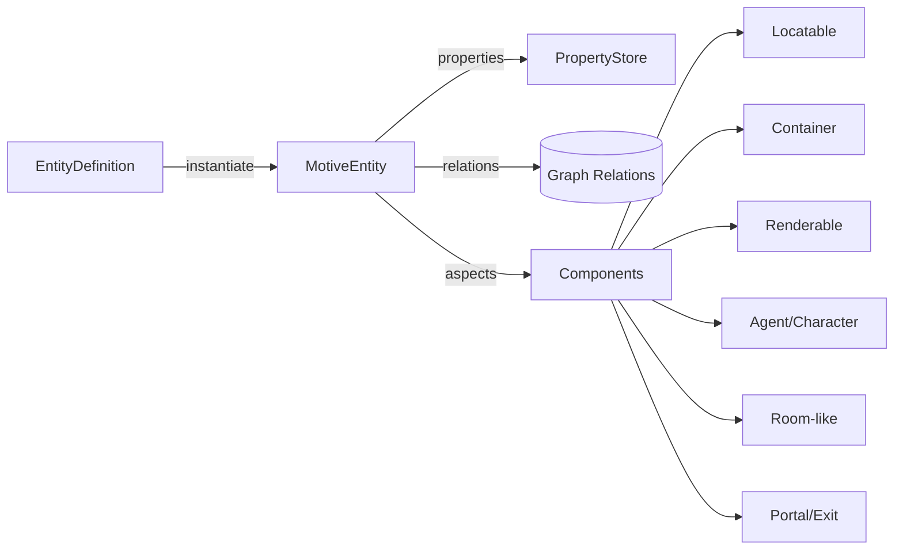

## Simulation v2 Plan — Modular, Composable Entity Graph

### Goals and Principles
- Build a flexible, composable simulation engine where characters manipulate a generalized object model via actions.
- Favor single-responsibility classes, clear module boundaries, and composition over inheritance.
- Unify state handling: one dynamic, typed property system for all entities (remove ad‑hoc tags).
- Make rules declarative where possible (conditions, effects, triggers, computed values), with Python hooks for escape hatches.
- Maintain backwards compatibility via loaders/adapters; migrate in phases without breaking existing content.
- Develop with TDD: small red/green cycles, incremental PRs, green main at all times.

### Directional Policy Update — v2 is the baseline (2025-09-17)
- The v2 minimal, deterministic integration tests are the source of truth for behavior and observability. Real game content (e.g., Hearth & Shadow) must conform to these semantics.
- Migration preserves the spirit of v1 content (names, descriptions, motifs, rooms/objects, any special H&S actions) while adopting v2 constructs fully.
- Enforce `attributes` (immutable) vs `properties` (mutable) semantics. Entity-level `config` dicts are not allowed in v2 YAML and are rejected at load time.
- Once H&S v2 parity is green, we will decommission v1 code and configs entirely; v2 becomes the new baseline for all future features.
- Post-migration, expand H&S to showcase v2 capabilities (triggers, affordances, visibility, computed props) and use findings to inform v3.

### High-Level Architecture Overview
At runtime, the world is a graph of entities with typed properties and relations. Logic is driven by declarative Conditions, Effects, and Triggers, with Actions orchestrating changes and an Event Bus driving observability.

- Entity Graph
  - MotiveEntity (runtime instance)
  - EntityDefinition (immutable template) → Instances (mutable state)
  - Relations: located_in, contains, linked_to, portal_to, knows_name_of, etc.
- Property System (typed, dynamic, mergeable, computed)
- Query Language (selector/graph traversal) used by Conditions/Effects/Triggers
- Condition DSL (shared across motives, requirements, triggers)
- Effects Engine (state mutation, movement, relation ops, event emission)
- Triggers (reactive, edge-detection true→false/false→true)
- Action Pipeline (parse → resolve → validate → apply effects → events)
- Event Bus & Observability (who sees what; player feedback)
- Adapters: v1 YAML → v2 Definitions; v1 Actions → v2 Effects

---

### Component Checklists (Features/Requirements)

#### Core Entity & Properties
- ☐ MotiveEntity core with per-entity dynamic typed properties
- ☐ EntityDefinition registry (immutable), instance creation API
- ☐ Property schema: string | number | boolean | enum (v2 MVP)
- ☐ Property merge rules across config layers (core → theme → edition → scenario)
- ☐ Internal hidden state (e.g., current_location) separated from exposed properties
- ☐ Computed properties with dependency tracking and cycle detection

#### Expressions & Safety
- ☐ String expression shorthand that parses into declarative YAML AST (no eval)
- ☐ Strict grammar, type-checked operators, deterministic behavior
- ☐ Round-trip and golden tests for parser; AST is the source of truth
- ☐ Python hooks for out-of-band logic beyond the DSL

#### Relations & Location/Containment
- ☐ `located_in` relation for characters/objects/exits
- ☐ `contains` relation for rooms, inventories, and container-like entities
- ☐ Move operation that updates relations atomically and emits events
- ☐ Future: nested containers (objects can contain objects) — spec + tests (out of MVP)

#### Exits (Unified) / Portals (Future)
- ☐ Exits modeled as entities with properties (direction, visible, traversable, locked, key_id)
- ☐ Visibility/traversability may be computed reactively (puzzle gating)
- ☐ Movement via exit effects that respect requirements/locks/visibility
- ☐ Portals (object-like, movable) planned as an extension of exits (lower priority)

#### Query Language (Selectors)
- ☐ Simple selectors by id, type, name, role (e.g., `#id`, `type:room`, `name:"torch"`)
- ☐ Graph traversal steps: `located_in`, `contains`, `linked_to`, `portal_to`
- ☐ Filters by property predicates (e.g., `prop:is_lit == true`)
- ☐ Aggregations (count, any, all) for conditions
- ☐ Parameter binding from action inputs to selectors

#### Condition DSL
- ☐ Shared engine for motives, action requirements, triggers, computed booleans
- ☐ Operators by type: equals, not_equals, greater_than, less_than, contains (string)
- ☐ Logical composition: and, or, not
- ☐ Selector-aware: evaluate against entity or query target sets

#### Effects Engine
- ☐ Property mutations: set, increment, toggle
- ☐ Relation ops: move entity, link/unlink entities
- ☐ Event emission with payloads for observability/logging
- ☐ Idempotency and conflict handling rules

#### Entity Lifecycle
- ☐ spawn_entity (from definition, with overrides), place into container/location
- ☐ destroy_entity / despawn with cleanup
- ☐ Clone/duplicate with new ids (optional)

#### Triggers (Reactive Model)
- ☐ On-change edge detection (false→true, true→false)
- ☐ Trigger to apply/undo effects; debounce and ordering
- ☐ Safety: prevent oscillations, detect cycles with computed props

#### Actions Pipeline
- ☐ Parser → Resolution → Requirements (conditions) → Effects → Events
- ☐ Built-in actions reimplemented atop Effects (look, move, say, read, pickup, drop, give, pass, help)
- ☐ Param schema validation; parameter binding to selectors/conditions
- ☐ Cost/AP accounting and partial failure rules

#### Affordances (Object-Contributed Actions)
- ☐ Entities can declare local actions (new verbs or specializations) via definitions
- ☐ Enable/disable actions declaratively based on properties/conditions
- ☐ Hooks to participate in existing actions (look/use/light) with localized effects
- ☐ Capability registry to resolve which actions are available for a target entity

#### Observability, Visibility & Events
- ☐ Event Bus; scoping (originator, room, adjacent rooms, global)
- ☐ Rich event payloads to support narrative rendering and training data
- ☐ Policies per action/effect defining observers
- ☐ Visibility model: `is_visible_to(actor)` computed via expressions (not granted automatically)
- ☐ Search/discover mechanics: actions can flip discovery/knowledge that affect visibility

#### NPC/Dialogue (Initial)
- ☐ Minimal reactive dialogue via triggers/conditions/effects
- ☐ Hooks for scripted responses; later expand to behavior trees if needed

#### Config v2 & Backwards Compatibility
- ☐ v2 YAML schemas for Definitions/Instances/Actions
- ☐ Loader that merges layers and instantiates entities
- ☐ Adapter that reads v1 configs and emits v2 definitions (no breaking change)
- Enforcement: entity-level `config` dicts are invalid in v2; load-time validation must error and instruct authors to move fields to `attributes` (immutable) or `properties` (mutable).

#### Tooling & Tests
- ☐ Golden tests for query/conditions/effects/trigger engines
- ☐ Profiling hooks and metrics for performance
- ☐ Lint/validate configs and detect cycles at load time
- ☐ TDD workflow docs and sample tests per module; CI gate on coverage/linters

##### Deterministic Integration Strategy (v2)
- ✅ Minimal, isolated feature tests with tiny v2 YAML configs per capability (move, inventory, look, etc.) using mocked LLMs with canned responses
- ☐ Medium-sized “combination” scenarios to validate interactions across features (also with mocked LLMs):
  - Inventory management task: move a set of objects from Room A to Room B using `pickup`, `drop`, `throw`, `move`; verify counts and observability
  - Communication relay: characters in multiple rooms pass messages via `whisper`, `say`, `shout`, with `move` between rooms; verify who hears what and when
  - Puzzles across rooms: combine `read`, `look`, `use`/`light` with exit state changes; verify conditions and success criteria advance
- ☐ Keep medium configs self-contained under `tests/configs/v2/combination_*` and tests under `tests/integration_v2/` with deterministic canned conversations

---

### Data Model (Runtime)



Key types:
- MotiveEntity: id, definition_id, type(s), properties, aspects, internal_state
- EntityDefinition: type(s), default properties, aspects, triggers, computed props
- PropertyStore: typed dynamic map, computed entries with dependencies
- Relations: adjacency sets (located_in, contains, linked_to, portal_to)
- Aspects (components): mix-in capabilities without deep inheritance

Initial aspects (modules):
- LocatableAspect (has location, can be moved)
- ContainerAspect (can contain entities; capacity rules later)
- RenderableAspect (names, short/long descriptions, aliases)
- AgentAspect (AP, motive binding, prompt IO, persona)
- RoomAspect (room-only affordances; non-movable)
- PortalAspect (direction, link targets, locks)
- ObservableAspect (visibility/observability rules)
- KnowledgeAspect (who knows what names/aliases)

---

### Property System
- Replace tags with typed properties.
- Property types (MVP): string, number, boolean, enum.
- Hidden internal state: `current_location`, `owner`, caches, etc.
- Merging rules (load-time): base → theme → edition → scenario → instance overrides.
- Computed properties:
  - declarative expressions referencing other properties/entities via selectors
  - cached with dependency graph; cycle detection at load; incremental recompute on change

Example (YAML v2 excerpt):
```yaml
definitions:
  torch:
    types: [object]
    properties:
      is_lit: { type: boolean, default: false }
      fuel: { type: number, default: 100 }
    computed:
      visibility_bonus:
        type: number
        expr: "is_lit ? 1 : 0"
```

Expressions:
- String form is only a shorthand; the authoritative config is a declarative YAML AST.
- Parser produces a typed AST with a limited, safe grammar (no arbitrary code).
- All operators are type-checked; unknown identifiers/ops are hard errors.
- For advanced cases, use Python hooks registered per definition.

---

### Query Language (Selectors)
Lightweight graph selector inspired by CSS/xpath/Cypher, designed for clarity:
- By id: `#raven`  | By type: `type:room` | By name: `name:"Torch"`
- Relations: `this.located_in`, `room.contains(type:object)`, `this.linked_to(type:portal)`
- Filters: `[prop.is_lit == true]`, `[prop.size == 'small']`
- Aggregations: `count(room.contains(type:player)) > 0`
- Parameters: `${target}` from action inputs bound into selectors/conditions

Example selectors:
```yaml
requires:
  all:
    - selector: this.located_in
      where: type:room
    - selector: ${target}
      where: type:object
```

---

### Condition DSL
Unified for motives, action requirements, triggers, computed booleans.

Operators (initial):
- equals, not_equals, greater_than, less_than, contains (string), any, all

Structure:
```yaml
conditions:
  any:
    - expr: "prop.is_lit == true"
    - expr: "count(this.located_in.contains(type:player)) > 1"
```

---

### Effects Engine
Built-in effect primitives:
- set_property / increment / toggle
- move_entity (update located_in/contains)
- link_entities / unlink_entities
- emit_event (with scope policies)
- spawn_entity / destroy_entity
- apply_status / remove_status (see Status Effects)

Example:
```yaml
effects:
  - set_property: { selector: this, key: is_lit, value: true }
  - emit_event:
      scope: room
      message: "${actor} lights the ${this.name}."
```

Idempotency & conflicts:
- Define last-writer wins for properties unless guarded by requirements.
- Movement validates capacity/constraints before applying.

---

### Triggers (Reactive Model)
Reactive rules attached to definitions:
- Fire when a condition transitions false→true; optional undo on true→false.
- Debounce and order by declaration; detect oscillation and cycles.

Example:
```yaml
triggers:
  - when: "prop.is_lit == true"
    then:
      - emit_event: { scope: room, message: "The torch glows brightly." }
    undo:
      - emit_event: { scope: room, message: "The torch goes dark." }
```

---

### Actions Pipeline (v2)
1) Parse (text → action name + params)
2) Resolve (bind params, resolve selectors)
3) Check Requirements (conditions)
4) Apply Effects (atomic group)
5) Emit Events (observability policies)
6) AP accounting and feedback

Built-in actions implemented via requirement/effect templates; Python hooks remain for complex logic.

Affordances Examples:
```yaml
definitions:
  torch:
    types: [object]
    properties:
      is_lit: { type: boolean, default: false }
    affordances:
      - action: light
        requires:
          expr: "prop.is_lit == false"
        effects:
          - set_property: { selector: this, key: is_lit, value: true }
          - emit_event: { scope: room, message: "${actor} lights the ${this.name}." }
      - action: extinguish
        requires:
          expr: "prop.is_lit == true"
        effects:
          - set_property: { selector: this, key: is_lit, value: false }
```

---

### Unified Exits (Priority) and Portals (Future)
- Exits gain properties and computed state: `direction`, `visible`, `traversable`, `is_locked`, `key_id`, `description`.
- Movement uses Exit effects and checks requirements (visibility, traversable, locks).
- Portals extend exits to object-like movable gateways; lower priority for v2 MVP.

---

### Rendering, Visibility & Knowledge
- RenderableAspect provides: id, name, short_name, short_desc, long_desc, aliases.
- KnowledgeAspect tracks what each character knows (e.g., learned names); affects rendering.
- Contextual rendering tiers:
  - Enter room → short_desc
  - Look room → long_desc + short listings of entities
  - Look entity → long_desc
- VisibilityAspect governs what entities are visible to whom; `search` can reveal hidden entities via property flips/knowledge updates.

Hidden/Discovered Items:
- Hidden entities default to not visible; discovery flips a property or adds knowledge enabling visibility and interaction.

---

### Config Schema v2 (Sketch)
Split into definitions and instances to avoid redundancy and enable composition.

```yaml
# defs.yaml
definitions:
  room_base:
    types: [room]
    properties:
      is_enclosed: { type: boolean, default: true }
  torch:
    types: [object]
    properties:
      is_lit: { type: boolean, default: false }

# world.yaml
instances:
  tavern:
    from: room_base
    properties:
      name: { type: string, default: "The Rusty Anchor Tavern" }
    contains:
      - id: torch_1
        from: torch
  player_1:
    types: [character]
    properties:
      name: { type: string, default: "Detective James Thorne" }
    located_in: tavern

# exits.yaml (sketch)
definitions:
  tavern_north_exit:
    types: [exit]
    properties:
      direction: { type: string, default: north }
      is_locked: { type: boolean, default: false }
      visible: { type: boolean, default: true }
      traversable: { type: boolean, default: true }
    computed:
      traversable:
        type: boolean
        expr: "prop.is_locked == false"
```

Back-compat loader maps v1 room/object YAML into v2 `definitions` + `instances` automatically.

---

### File/Module Layout (Proposed)
```
motive/
  sim_v2/
    __init__.py
    engine_context.py          # Event bus, registry, world access
    entity.py                  # MotiveEntity (runtime)
    definitions.py             # EntityDefinition, registry, loader
    properties.py              # Typed property store, computed props
    relations.py               # Graph relations and operations
    query.py                   # Selector language and evaluation
    conditions.py              # Condition DSL
    effects.py                 # Effect primitives and runner
    triggers.py                # Reactive engine
    aspects/
      locatable.py
      container.py
      renderable.py
      visibility.py
      agent.py
      room.py
      portal.py
      observable.py
      knowledge.py
      affordances.py
      status_effects.py
    actions/
      engine.py               # Parse/resolve/validate/apply pipeline
      builtins/
        look.py
        move.py
        say.py
        read.py
        pickup.py
        drop.py
        give.py
        pass_turn.py
        help.py
    adapters/
      v1_loader.py            # Map current YAML → v2 definitions/instances
      v1_actions.py           # Bridge v1 action config → v2 templates
```

`GameMaster` stays as orchestrator and uses `sim_v2.engine_context` to run turns. We introduce an adapter layer so v1 and v2 can co-exist during migration.

---

### Migration Plan (Phased)
Phases minimize risk and keep the game playable throughout.

1) Scaffolding & Adapters
   - Create `sim_v2` skeleton; implement adapters that read v1 configs to v2 definitions (no behavior change).
   - Add engine context and entity wrappers around current runtime state.

2) Properties Unification
   - Replace tags with typed properties at the wrapper layer; keep v1 interfaces intact.
   - Add merging rules and basic computed properties.

3) Query + Conditions Unification (with Parser)
   - Implement selectors and the shared Condition DSL.
   - Implement string shorthand parser → YAML AST; golden tests for safety and robustness.
   - Migrate motives and action requirements to the unified system.

4) Effects Engine
   - Implement property and relation effect primitives (set/move/link/events).
   - Re-implement a subset of built-in actions using effects.

5) Unified Exits & Visibility
   - Model exits as entities; implement `visible` and `traversable` properties (computed).
   - Integrate puzzles by tying exit state to object properties/conditions.

6) Visibility & Rendering
   - Implement VisibilityAspect (`is_visible_to`) and search/discover mechanics.
   - Route narrative via Event Bus; define scopes and payloads.

7) Triggers (Reactive)
   - Enable triggers in definitions (edge detection + undo).
   - Add safety (debounce, oscillation detection).

8) Containers & Inventories
   - Switch inventories and room contents to ContainerAspect.
   - Plan/spec for nested containers (enable later).

9) Affordances
   - Enable object-contributed actions; capability resolution; enable/disable rules.

10) NPC/Dialogue (Initial)
   - Add reactive responses using triggers/conditions and scripted hooks.

11) Status Effects
   - Apply/remove with durations; property overlays; stacking policy; inventory/inherent sources.

12) Entity Lifecycle
   - spawn_entity/destroy_entity effects; placement; id generation.

13) Decommission Legacy Paths
   - Once parity is reached, remove tags and legacy condition paths.
   - Document final v2 schemas and migration steps for content authors.

Acceptance criteria per phase:
- Each phase gated by unit/integration tests and human playtest.
- Backwards compatibility maintained until decommission phase.

---

### Risks & Trade-offs
- Over-flexibility vs. simplicity: we scope the query/DSL to proven use cases.
- Reactive complexity (triggers/computed): mitigate via cycle detection and debouncing.
- Performance: cache selector results and computed props; measure with profiling hooks.
- Security: strict expression grammar, no eval, resource/time limits, fuzz tests.

### Open Questions
- How much of behavior should be exposed declaratively vs. Python hooks?
- How to package reusable definition libraries across themes/editions cleanly?
- Do we need namespacing/versioning for definitions and actions?
- Naming for status/ailment system to avoid clash with Condition DSL?

---

### Immediate Next Steps (Updated Reality Check — 2025-09-16)
1) Motive condition parsing: ensure v2 motives load into real condition trees (no `dummy`).
2) Action parsing robustness: accept `> verb ...` in mixed-prose LLM responses.
3) Object/NPC interactions: parameter binding and alias/name resolution in requirements.
4) Movement via exits: normalize exit aliases in conversion; verify `move` works.
5) Event scopes: tests for originator/room/adjacent observers.

---

### Status Effects (Boons/Banes) — Concept
Non-stacking, time/condition-bound modifiers applied to entities. Sources include actions, environment, inventory, and inherent traits.

Features:
- Duration: turns/time or until-condition; on-apply/on-expire triggers
- Overlay: temporarily set/modify properties (e.g., `can_see_in_dark` from Dark Vision)
- Stacking policy: no-stack, refresh, or limited stacks (configurable per effect)
- Sources: inherent (traits), inventory-carried (auras), action-applied (e.g., stunned)
- UI/Rendering: visible to actor or observers based on visibility/knowledge settings

Effects API:
```yaml
effects:
  - apply_status:
      target: ${actor}
      name: stunned
      duration_turns: 3
      overlays:
        can_act: false
  - remove_status: { target: ${actor}, name: stunned }
```

---

### Plan Maintenance and Status
- This document is a living plan. Update after every meaningful change.
- Keep priorities current and reflect completed/in-progress work.

#### Current Work Queue (Prioritized — updated)
1. ☐ Motive condition parsing end-to-end (config → runtime) with tests
2. ☐ Robust action parsing from LLM text with tests
3. ☐ Object/NPC interaction requirements + alias resolution with tests
4. ☐ Movement via exits/aliases verification with tests
5. ☐ Event scopes (originator/room/adjacent) tests
6. ✅ Scaffold core modules: `entity`, `properties`, `relations`, `definitions`
7. ✅ Minimal TDD tests for entity/properties/relations
8. ✅ v1→v2 adapters for rooms/objects/characters (no behavior change)
9. ✅ Replace tags with typed properties at wrapper layer
10. ✅ Query + Condition DSL (with string→AST parser)
11. ✅ Effects primitives (set/move/link/emit)
12. ✅ Unified exits (visible/traversable/locked) + computed gating
13. ✅ VisibilityAspect + search/discover mechanics
14. ✅ Triggers (edge detection + undo)
15. ✅ Affordances (object-contributed actions)
16. ✅ Status effects (apply/remove/duration/overlays)
17. ✅ Entity lifecycle (spawn/destroy/clone)
18. ☐ Portals (future extension of exits)

#### Recently Completed
- ✅ Drafted SIMULATION_V2_PLAN.md and got approval
- ✅ Created package stub `motive/sim_v2/__init__.py`
- ✅ Scaffolded core modules: `entity.py`, `properties.py`, `definitions.py`, `relations.py`
- ✅ Added minimal TDD tests: `tests/test_sim_v2_minimal.py` (3 tests passing)
- ✅ Implemented typed property system with validation (string/number/boolean/enum)
- ✅ Implemented entity definitions and instantiation with overrides
- ✅ Implemented relations graph for container/location management
- ✅ Implemented v1→v2 adapters: `adapters.py` with comprehensive TDD tests (5 tests passing)
- ✅ Adapter converts v1 rooms/objects/characters to v2 definitions with type inference
- ✅ Adapter handles object instances with property overrides and graceful error handling
- ✅ Implemented wrapper layer: `wrapper.py` with TDD tests (3 tests passing)
- ✅ V1EntityWrapper converts tags to typed properties while maintaining v1 compatibility
- ✅ Wrapper handles missing tags gracefully and preserves v1 interface access
- ✅ Implemented condition DSL: `conditions.py` with TDD tests (7 tests passing)
- ✅ ConditionParser converts string expressions to AST (==, >, < operators)
- ✅ ConditionEvaluator evaluates conditions against entity properties with type inference
- ✅ Implemented query system: `query.py` with TDD tests (5 tests passing)
- ✅ QueryEngine parses "entity.relation.target where condition" syntax
- ✅ Query execution integrates with RelationsGraph and supports condition filtering
- ✅ Implemented effects primitives: `effects.py` with TDD tests (5 tests passing)
- ✅ SetPropertyEffect and MoveEntityEffect for declarative state changes
- ✅ EffectEngine executes multiple effects in sequence with graceful error handling
- ✅ Implemented unified exits: `exits.py` with TDD tests (5 tests passing)
- ✅ ExitManager handles exit creation, state management (visible/traversable/locked)
- ✅ Direction mapping and traversal validation with RelationsGraph integration
- ✅ **CRITICAL**: Added real YAML integration tests: `test_sim_v2_integration.py` (8 tests passing)
- ✅ Integration tests validate v1→v2 conversion against real `hearth_and_shadow_*` configs
- ✅ Fixed missing methods: `DefinitionRegistry.create_entity()`, `MotiveEntity.get_property()`
- ✅ Enhanced condition system with `contains` operator for string matching
- ✅ Verified end-to-end migration works with real room/object/character data
- ✅ Implemented visibility system: `visibility.py` with TDD tests (6 tests passing)
- ✅ VisibilityEngine handles computed visibility, search mechanics, and discovery
- ✅ Search actions can reveal hidden entities with `searchable` property
- ✅ Cross-room visibility validation and entity filtering
- ✅ Implemented triggers system: `triggers.py` with TDD tests (6 tests passing)
- ✅ TriggerEngine provides reactive behavior with edge detection (false→true, true→false)
- ✅ Effects execution on activation and undo effects on deactivation
- ✅ Enhanced EffectEngine to handle both dict and object entities
- ✅ Implemented affordances system: `affordances.py` with TDD tests (5 tests passing)
- ✅ AffordanceEngine manages object-contributed actions with condition-based availability
- ✅ Action execution through affordances with effect application
- ✅ Created enhanced YAML configs showcasing sim_v2 features: `*_v2.yaml` files
- ✅ Enhanced configs demonstrate triggers, affordances, visibility, and computed properties
- ✅ Fixed YAML syntax errors and AND operator parsing/evaluation in condition system
- ✅ Created comprehensive integration tests: `test_sim_v2_enhanced_configs.py` (9 tests passing)
- ✅ All enhanced config tests validate real-world sim_v2 feature usage
- ✅ Implemented status effects system: `status_effects.py` with TDD tests (6 tests passing)
- ✅ StatusEffectManager handles duration-based property overlays with stacking policies
- ✅ Support for temporary effects (duration_turns), permanent effects (duration_turns: null), and multiple sources
- ✅ Enhanced character config showcases status effects: investigation_fatigue, cult_corruption, partner_memory
- ✅ Created comprehensive status effects config tests: `test_sim_v2_status_effects_config.py` (4 tests passing)
- ✅ All 79 sim_v2 tests passing with status effects integration
- ✅ Implemented entity lifecycle system: `entity_lifecycle.py` with TDD tests (7 tests passing)
- ✅ EntityLifecycleManager handles spawn/destroy/clone operations with unique ID generation
- ✅ Support for entity states (ACTIVE, DESTROYED, CLONED) and lifecycle event tracking
- ✅ Enhanced character config showcases entity lifecycle: evidence_bag and investigation_note spawning
- ✅ Created comprehensive entity lifecycle config tests: `test_sim_v2_entity_lifecycle_config.py` (5 tests passing)
- ✅ All 91 sim_v2 tests passing with entity lifecycle integration
- ✅ Implemented portals system: portals.py with TDD tests (7 tests passing)
- ✅ PortalManager handles static and dynamic portals with destination management
- ✅ Support for portal traversal conditions and property management
- ✅ Created comprehensive portal integration tests: test_sim_v2_portals_containers_integration.py (9 tests passing)
- ✅ Created enhanced action integration tests: test_sim_v2_enhanced_action_integration.py (8 tests passing)
- ✅ **Corrected Shout Observability**: Sound now propagates through portals to destination rooms
- ✅ **Unified Move Action**: Single `move` command works with normal exits, portals, and containers
- ✅ **Enhanced Throw Action**: Objects can be thrown through portals, into containers, and portals/containers themselves can be thrown
- ✅ **Mixed Exit Types**: Rooms can have normal exits, portals, and container entrances simultaneously
- ✅ Implemented containers system: containers.py with TDD tests (8 tests passing)
- ✅ ContainerManager handles bag of holding, portable hole, and magic tent types
- ✅ Support for owned interior spaces with unique room generation and capacity management
- ✅ Container enter/exit mechanics with location tracking for proper observability
- ✅ All container tests validate integration with core actions and observability system
- ✅ Created container interior interaction tests: test_sim_v2_container_interior_interactions.py (7 tests passing)
- ✅ **Container Interior Spaces**: Both objects and characters can exist and interact normally inside containers
- ✅ **Interior Observability**: Actions inside containers are only visible to players in the same interior
- ✅ **Interior State Persistence**: Objects and interior state persist when players exit/re-enter containers
- ✅ **Multiple Container Isolation**: Different containers have separate, isolated interior spaces
- ✅ All 130 sim_v2 tests passing with complete portals and containers integration
- ✅ Implemented actions pipeline: actions_pipeline.py with TDD tests (9 tests passing)
- ✅ ActionPipeline manages action definitions with parameters, requirements, and effects
- ✅ Support for parameter validation, requirement evaluation, and effect execution
- ✅ Integration with sim_v2 Effects, Conditions, and Relations systems
- ✅ Parameter substitution in effects and condition evaluation with entity property paths
- ✅ All 139 sim_v2 tests passing with actions pipeline integration
- ✅ Implemented comprehensive v1→v2 migration system: config_loader.py with V2ConfigLoader
- ✅ V2ConfigLoader supports hierarchical config loading, v1 migration, and v2 native configs
- ✅ Migration preserves all content: rooms, objects, characters, actions with error handling
- ✅ Created comprehensive migration tests: test_sim_v2_config_migration.py (12 tests passing)
- ✅ Created full migration integration tests: test_sim_v2_full_migration_integration.py (7 tests passing)
- ✅ Migration works with v2 systems: RelationsGraph, EffectEngine, PropertyStore integration
- ✅ Enhanced MotiveEntity with set_property() method for property modification
- ✅ Fixed EffectEngine to handle PropertyStore objects correctly
- ✅ All 158 sim_v2 tests passing with complete migration system
- ✅ **ACTUAL CONFIG MIGRATION COMPLETE**: Migrated all hearth_and_shadow v1 configs to v2 format
- ✅ Created migrated configs: hearth_and_shadow_*_migrated.yaml files preserving all original content
- ✅ Migration statistics: 11 rooms, 65 objects, 8 characters migrated successfully
- ✅ Created migration script: migrate_configs.py for automated v1→v2 conversion
- ✅ Created migrated config tests: test_sim_v2_migrated_configs.py (7 tests passing)
- ✅ Migrated configs work with all v2 systems: RelationsGraph, EffectEngine, PropertyStore
- ✅ All 165 sim_v2 tests passing with complete migration and migrated configs

#### New Findings / Backlog
- ☐ Expression safety fuzz tests and resource/time limits
- ☐ **Documentation Updates Required**: Update MANUAL.md and other docs when v2 implementation/migration is complete
- ☐ **Enhanced Hearth & Shadow Configs**: Add magic mirrors, bags of holding, portable holes, and other sim_v2 objects to showcase new features


This plan enables incremental delivery while steering toward a composable, powerful simulation engine that cleanly separates definitions from instances and centralizes state change via a unified effects system.


